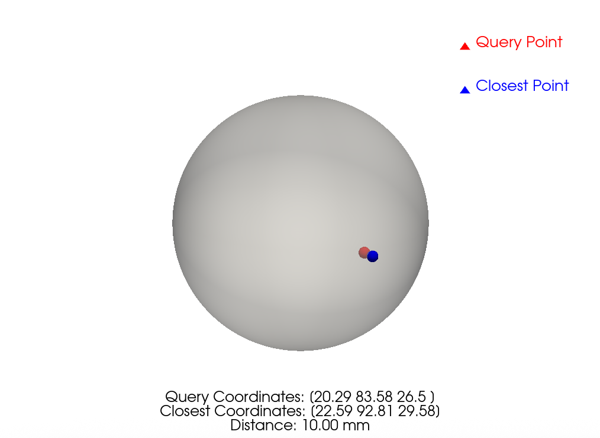

Get Closest Point on Scalp
==========================

This script provides functionality to find the point on the scale (provided as a VTK file) that is closest to a given query point.

Requirements
------------
- Python 3.9 or higher
- PyVista
- NumPy
- SciPy

Usage
-----
```bash
usage: main.py [-h] [--scalp_fn SCALP_FN] [--query_point QUERY_POINT QUERY_POINT QUERY_POINT] [--method METHOD] [--print_source_coord] [--print_closest_coord]
               [--print_distance] [--benchmark]

Find the point on the scalp closest to a given query point.

options:
  -h, --help            show this help message and exit
  --scalp_fn SCALP_FN, -s SCALP_FN
                        Path to the scalp VTK file.
  --query_point QUERY_POINT QUERY_POINT QUERY_POINT, -q QUERY_POINT QUERY_POINT QUERY_POINT
                        Query point coordinates.
  --method METHOD, -m METHOD
                        Method to use for finding the closest point. Options: 'closest_point_pv', 'kd_tree_scipy', 'reference'. Default is 'closest_point_pv'.
  --print_source_coord, -ps
                        Print the source coordinates. Default is True.
  --print_closest_coord, -pc
                        Print the closest coordinates. Default is True.
  --print_distance, -pd
                        Print the distance to the closest point. Default is True.
  --benchmark, -b       Run benchmark tests.
  --demo, -d            Run a demo with a predefined surface and query point.
```

For example, for a query point at coordinates `(-48.97, 11.73, 56.77)` and scalp surface saved in `whole_skull.vtk`, you can run:

```bash
python ./main.py -s whole_skull.vtk -q -48.97 11.73 56.77 -m closest_point_pv -ps -pc -pd
```

To compare the performance of different methods, you can run:

```bash
python ./main.py -b
```

The result would look like this:


Should you wish to reproduce the demo, you can run:

```bash
python ./main.py -d
```
